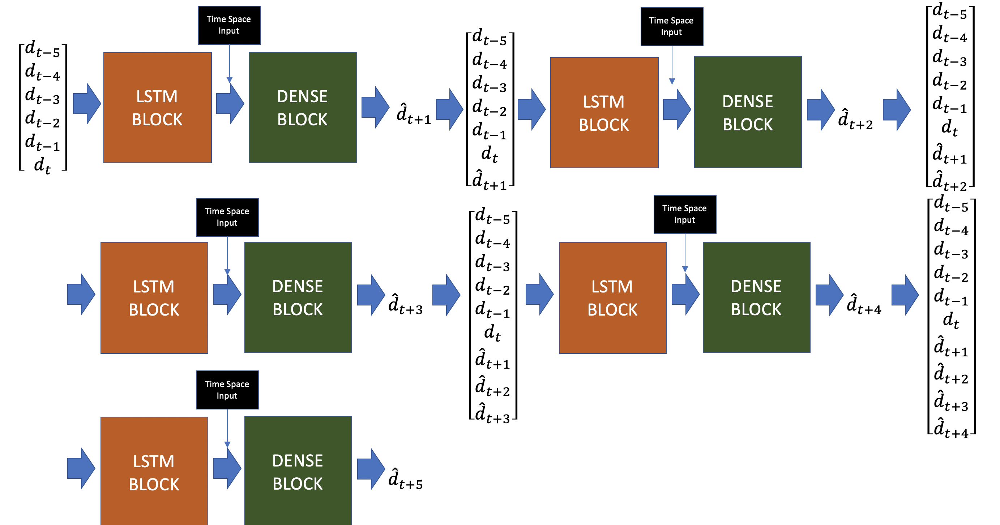

# traffic-management-aiforsea
https://www.aiforsea.com/traffic-management

Submission by **Kilian Tep**

In order to understand my thought-process, take a look at the two following Medium articles:

[AI For SEA Traffic Management: Feature Engineering (Part 1/2)](https://medium.com/@kiliantep/ai-for-sea-traffic-management-feature-engineering-part-1-2-e54f8d4eaa9e?postPublishedType=repub)

Old approach -- **Outdated, irrelevant to this branch):
[AI For SEA Traffic Management: Modeling (Part 2/2)](https://medium.com/@kiliantep/ai-for-sea-traffic-management-modeling-part-2-2-45cf301bd37?postPublishedType=repub)

## Getting started
Install necessary dependencies with virtual environment**:
```bash
git clone https://github.com/KilianTep/traffic-management-aiforsea.git

cd ~/traffic-management-aiforsea/

# install virtual environment for python3
python3 -m pip install virtualenv
python3 -m virtualenv venv

# once the venv is activated, we will just need to specify python instead of python3
source ./venv/bin/activate

# install requirements
pip install -r requirements.txt

# export right python path
export PYTHONPATH=$(pwd)
```

## Recommended procedure for smooth running
Download the `training.csv` from https://www.aiforsea.com/traffic-management and 
place it inside the folder `./dataset`.

### 1. Preprocessing and feature engineering
In order to preprocess the training set and create the necessary features before training:
```bash
python ./src/preprocess_dataset.py --csv_path ./dataset/training.csv --output_path ./dataset
```
This procedure may take some time, depending on your machine's computing power.

### 2. Model training
**If you wish to retrain the model**, you can run the following command. It is strongly advised you connect your machine
to GPU resources. (I assume you have followed the above procedure before running the command) 
```bash
python ./src/train_model.py --transformed_train_path ./dataset/training.csv_transformed.snappy.parquet --output_model_path ./models --epochs 30 --batch_size 256 --log_path ./src/logs
```
The model was trained on the first six weeks of the dataset and evaluated on the last two weeks.
You can also save the training logs in the specified output path for `--log_path`

If you wish to retrain the model based on previous weights specify the path for `--pretrained_weights`

### 3. Model evaluation
**If you do not wish to retrain the model**, you can simply use the file `./models/best_window_lstm_model` by running the following commands:
```bash
# If you want to use your own test set, you need to preprocess it first:
python ./src/preprocess_dataset.py --csv_path <PATH_TO_CSV_TEST> --output_path ./dataset

# pass in the preprocessed test set into the following command:
python ./src/evaluate_model.py --model_path ./models/best_window_lstm_model --transformed_test_df_path ./dataset/<PATH_TO_CSV_TEST>_transformed.snappy.parquet 
```
**Warning:** your csv test file must have the same schema as `./dataset/training.csv`.

If you've retrained the model, simply modify the argument `--model_path` with the corresponding path.

The script `./src/evaluate_window_model.py` will give you the MSE and RMSE performance of the model at T+1 until T+5.

The evaluation is now much faster than what it used to be as the new architecture predicts all time steps all at once.

## High level overview of Window LSTM architecture
Description of Time Space Input


Overall architecture 


Unlike the old version, this LSTM architecture aims to predict the demand at **Demand T+1 until T+5** in the same architecture.

The first input layer takes in a **vector of size 6 consisting of Demand T until Demand T-5.**
It then passes on this input layer into a few LSTM layers.

The second input layer takes in a **vector of size 8 consisting of the following normalized values (Min-Max Scaling):
latitude, longitude, timestamp at time T, ..., timestamp at time T-5.**

My intuition was that the location as well as the time of the day would have a strong impact on the demand. I basically
sought to combine the pure demand input with the time and space input so that the model learns the relationship with 
respect to demand at T+1.

During the training, I also gave **exponential weighting** to the samples based on their demand.
I noticed that the distribution of demand was very low in majority so I wanted to make sure the model learn well on the
high peak demands. The weighting simply followed this formula:

``
sample_weight = exp(demand * 10)
``

## Training Methodology and Results
I trained the model on the first 47 days and evaluated its performance on the 
remaining 14 ones. Roughly, the training set has about 3.2 million samples and
the test set has nearly 1 million samples.

Unlike the previous architecture, the Keras backend is able to give me the performance on the model of each time step:


## Other
You can check out my `./notebooks/preliminary_analysis.ipynb` to see the analysis that encouraged some of my thinking
when deciding on the architecture and feature selection.